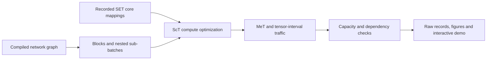
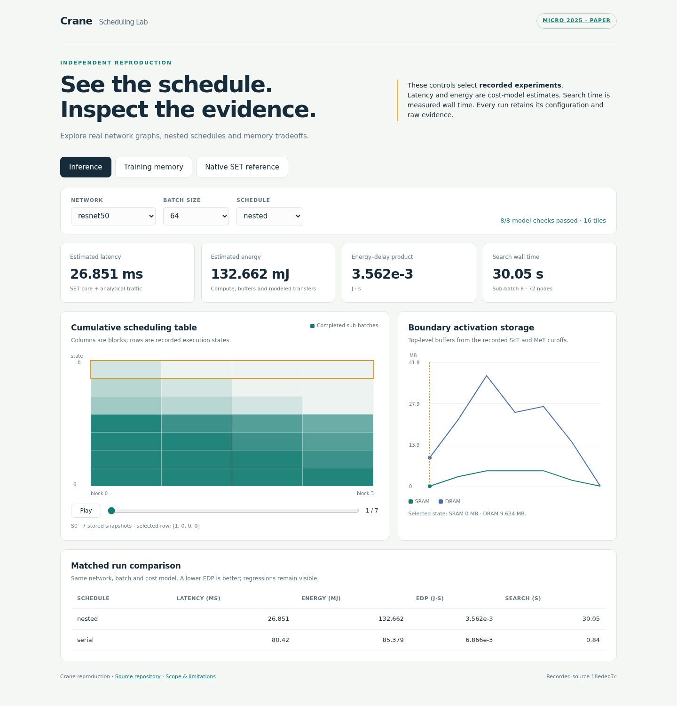

# Crane · Reproduction & Scheduling Lab

[](https://github.com/aHappend/Crane/actions/workflows/ci.yml)
[](docs/EXPERIMENTS.md)
[](https://doi.org/10.1145/3725843.3756023)

**An independent Python reproduction and experiment lab for Crane's inter-layer
DNN scheduling method.** Inspect real network graphs, optimize ScT/MeT tables,
compose nested schedules, and reproduce recorded experiments with native SET
intra-layer cost profiles.

[English](README.md) · [简体中文](README.zh-CN.md) ·
[Recorded results](experiments/results/reproduction_20260921/REPORT.md) ·
[Demo](#interactive-demo) · [Reproduction scope](docs/REPRODUCTION.md)

> **Research status:** inference experiments now use real network definitions and
> recorded SET core mappings. Training includes a checked uniform-cohort reference
> and a separate experimental MILP path. Full placement/traffic calibration and
> reproduction of all paper figures or headline speedups remain unestablished.

## Paper and relationship to SET

**Crane: Inter-Layer Scheduling Framework for DNN Inference and Training
Co-Support on Tiled Architecture** — Yu Gong, Lingyi Huang, Haodong Chang,
Rongjian Liang, Cheng Yang, Zhexiang Tang, Jiang Hu, and Bo Yuan.
**MICRO 2025**, pp. 1250–1263.

[DOI / publisher](https://doi.org/10.1145/3725843.3756023) ·
[Paper PDF](include/crane_paper.pdf) · [Citation metadata](CITATION.cff)

Crane and SET are different scheduling frameworks. The Crane paper uses SET for
cost-model validation and as an inference baseline. This repository imports
SET's compiled network definitions, can reuse its Polar intra-layer mapper, and
runs its native inter-layer search separately as a reference. The Python Crane
scheduler is an independent implementation; the paper's implementation is C++.

## What is implemented

- **16 real network definitions**, exported from a pinned SET revision with
  tensor shapes, operation counts, residual branches and activation/weight edges.
- **ScT and MeT optimization**, per-sample workload scaling, sample-index-aware
  traffic accounting, solver deadlines, termination status and bounds.
- **Exact fixed-cost ScT EDP options:** a normalized integer-product MILP and an
  equivalent vertex reduction for eligible canonical inference problems.
- **Nested sub-batch composition:** children process exactly one parent sub-batch
  within assigned tiles and conservative memory budgets. Serial micro-batch
  schedules provide a feasible alternative for small batches.
- **Recorded native SET core profiles** for ResNet-50, VGG-19, GoogLeNet and a
  Transformer cell, plus seeded native SET reference runs.
- **Training memory reference:** explicit FW/BW1/recomputation/BW2 cohorts,
  operation conservation and capacity checks, including the paper's Figure-6
  cohort example.
- **An experiment runner and offline demo** with raw evidence, figures, timing,
  source hashes, configuration and dependency records.



These are scheduling and cost-model experiments. They run on a CPU without
training model weights or downloading datasets.

## Quick start

Use Python 3.11–3.13 and run commands from the repository root:

```bash
git clone https://github.com/aHappend/Crane.git
cd Crane
python -m venv .venv
```

Activate with `source .venv/bin/activate` on Linux/macOS or
`.\.venv\Scripts\Activate.ps1` in Windows PowerShell, then:

```bash
python -m pip install -r requirements.txt -c constraints.txt
python tools/doctor.py
python example/quickstart.py
```

The small synthetic example exercises both real SCIP table solvers and writes
`summary.json` and `schedule.html` under `outputs/experiments/quickstart_<timestamp>/`.
Use a new `--output-dir` to choose another destination. No GPU or commercial
solver service is required.

## Interactive demo

Open **[docs/demo/index.html](docs/demo/index.html)** locally after cloning.
It is self-contained and works without a server or network access. Alternatively:

```bash
python -m http.server 8000 --bind 127.0.0.1 --directory docs/demo
```

Open `http://127.0.0.1:8000` on that machine. For an SSH server, forward the port
from your own computer with `ssh -L 8000:127.0.0.1:8000 <your-host>`.

The demo selects **recorded runs**: compare schedules, play through ScT states,
inspect activation storage, explore training capacity and view seeded SET runs.
Changing a selector does not run a new optimization in the browser.



## Recorded experiments

The [full report](experiments/results/reproduction_20260921/REPORT.md) contains
10 inference runs, 9 training capacity configurations (7 feasible and 2 infeasible
under the reference policy), and 12 native SET runs over three fixed seeds.
Raw records are archived with hashes; negative results are retained.


The figure compares nested scheduling with a serial reference using the **same
SET core profiles and analytical traffic model**, batch 64 and 16 tiles.
VGG-19's slight regression is visible. Native SET results use a different outer
traffic/placement evaluator and are reported separately.

Run the main suites:

```bash
python -m experiments.run --config experiments/configs/native_core_inference.json --output-dir outputs/experiments/my-inference
python -m experiments.run --config experiments/configs/training_memory.json --output-dir outputs/experiments/my-training
```

The checked-in cost profiles make these commands independent of a C++ compiler.
Each case has a process deadline and records errors or infeasibility explicitly.
See [EXPERIMENTS.md](docs/EXPERIMENTS.md) for regeneration, native SET execution,
plotting, units and result interpretation.

## Code map

| Directory | Responsibility |
| --- | --- |
| `workloads/` | Compiled graph metadata, loader and initial hierarchy |
| `model/` | Layer objects and DAG validation |
| `scheduler/` | ScT/MeT, exact objectives, traffic intervals, hardware profiles |
| `search/` | Flat search, nested composition and training policies |
| `cost_model/` | Analytical costs and recorded SET core adapter |
| `experiments/` | Configurations, isolated runs, profiles, raw results and reports |
| `tools/` | Environment check and pinned upstream extraction/baseline tools |
| `example/` | Quick start and retained exploratory examples |
| `tests/` | Mathematical oracles, graph/traffic regressions and integration tests |
| `docs/demo/` | Self-contained interactive recorded-run explorer |

Read the [architecture](docs/ARCHITECTURE.md),
[mathematical audit](docs/MATHEMATICAL_AUDIT.md) and
[paper-to-code map](docs/REPRODUCTION.md) before changing a cost assumption.
The old `official_nns` examples remain historical proxy experiments; use the
`experiments/` suites for the real exported networks.

## Development

```bash
python -m pip install -r requirements-dev.txt -c constraints.txt
python -m ruff check .
python -m pytest -q
```

CI runs on Linux/Python 3.11 and 3.13 and Windows/Python 3.11. It checks SCIP,
mathematical/behavioral invariants and entrypoints, and uploads a quick-start
report. Long experiment matrices are run separately with their recorded budgets.

See [CONTRIBUTING.md](CONTRIBUTING.md), [CHANGELOG.md](CHANGELOG.md) and
[THIRD_PARTY_NOTICES.md](THIRD_PARTY_NOTICES.md). The repository has no blanket
software license declared; reference material retains its own terms.

## Citation and attribution

Cite the Crane paper for the method and identify this repository's commit and
experiment manifest when using the implementation:

```bibtex
@inproceedings{gong2025crane,
  author = {Gong, Yu and Huang, Lingyi and Chang, Haodong and Liang, Rongjian
            and Yang, Cheng and Tang, Zhexiang and Hu, Jiang and Yuan, Bo},
  title = {Crane: Inter-Layer Scheduling Framework for {DNN} Inference and
           Training Co-Support on Tiled Architecture},
  booktitle = {Proceedings of the 58th IEEE/ACM International Symposium on Microarchitecture},
  year = {2025},
  pages = {1250--1263},
  doi = {10.1145/3725843.3756023}
}
```

For the imported network definitions, native cost profiles or SET baseline,
also cite Cai et al., *Inter-layer Scheduling Space Definition and Exploration
for Tiled Accelerators*, ISCA 2023,
[DOI: 10.1145/3579371.3589048](https://doi.org/10.1145/3579371.3589048).
