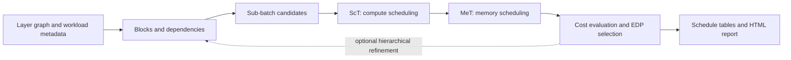

# Crane · Python Reproduction

[](docs/EXPERIMENTS.md)
[](https://doi.org/10.1145/3725843.3756023)

**An independent Python implementation of the scheduling workflow described in
Crane, for studying inter-layer scheduling of DNN inference and training on tiled
architectures.**

[English](README.md) · [简体中文](README.zh-CN.md) · [Quick start](#quick-start) ·
[Experiments](docs/EXPERIMENTS.md) · [Reproduction status](docs/REPRODUCTION.md)

> **Research status:** the core scheduling workflow is implemented and tested on
> small examples. The supplied network experiments use proxy workload metadata.
> This repository is an independent reproduction, not the authors' C++ artifact;
> it has not established reproduction of the paper's reported speedups or EDP results.

## The paper

**Crane: Inter-Layer Scheduling Framework for DNN Inference and Training
Co-Support on Tiled Architecture**

Yu Gong, Lingyi Huang, Haodong Chang, Rongjian Liang, Cheng Yang,
Zhexiang Tang, Jiang Hu, and Bo Yuan. **MICRO 2025**, pp. 1250–1263.

[Publisher / DOI](https://doi.org/10.1145/3725843.3756023) ·
[Paper PDF](include/crane_paper.pdf) · [Citation metadata](CITATION.cff)

Crane represents execution and memory decisions as hierarchical tables, so a
scheduler can explore execution order, fusion, batch splitting and recomputation
together. This project implements a Python workflow around those ideas using
NumPy and the SCIP backend shipped with OR-Tools.

## What you can do

- Build layer graphs and hierarchical blocks, and inspect their dependencies.
- Search sub-batch candidates using a **Scheduling Table (ScT)** and SRAM/DRAM
  **Memory Tables (MeT)**, then evaluate estimated latency, energy and EDP.
- Explore block merging, recursive scheduling and structure refinement.
- Study the **FW / BW1 / BW2** training scheduling paths and recomputation.
- Export readable schedules as JSON, text, CSV or self-contained HTML, depending
  on the experiment entrypoint.



This is a scheduling model: it runs on a CPU and does not execute a neural network
on a GPU, train model weights, or simulate individual hardware cycles.

## Quick start

Use **Python 3.11–3.13**. No dataset, GPU, external solver service or commercial
solver license is needed for the included quick start. Run commands from the
repository root.

```bash
git clone https://github.com/aHappend/Crane.git
cd Crane
python -m venv .venv
```

Activate the environment on Linux/macOS:

```bash
source .venv/bin/activate
```

Or in Windows PowerShell:

```powershell
.\.venv\Scripts\Activate.ps1
```

Install the recorded dependency versions and check that SCIP works:

```bash
python -m pip install -r requirements.txt -c constraints.txt
python tools/doctor.py
python example/quickstart.py
```

The quick start schedules a **synthetic three-layer chain** through both real
solvers with fallback disabled. It prints the selected sub-batch, solver names,
and estimated latency / energy / EDP, and creates:

```text
outputs/experiments/quickstart_<timestamp>/
├── summary.json     # workload, full config, versions, Git revision, results
└── schedule.html    # states, cumulative ScT and memory tables
```

Open `schedule.html` in a browser. A successful run reports `ortools-scip` for
both ScT and MeT. The smoke test validates the workflow; its estimates are not a
paper benchmark. Different solver versions can choose different tied schedules.

Use `--output-dir <new-directory>` to choose the destination. Existing directories
are refused so previous results are preserved.

## Experiments and reproduction scope

| Entry point | Purpose | Workload / interpretation |
| --- | --- | --- |
| `example/quickstart.py` | Check installation and inspect a complete run | Three synthetic layers; small and CPU-only |
| `example/run_official_nns_suite.py` | Compare 12 network-family proxies with block merging | Hand-authored metadata associated with SET network definitions |
| `example/run_official_nns_layer_level.py` | Schedule the same proxy families without merging | Each proxy node is one block; not an exact full-network import |
| `example/compare_transformer_granularity.py` | Compare stage and layer granularity, optionally using §7.2 hardware | Manually expanded 471-node Transformer chain with proxy costs |
| `example/run_transformer_training_repro.py` | Explore FW / BW1 / BW2 using §7.3-style hardware | Synthetic Transformer costs and scaled backward/recompute work |

See the [experiment guide](docs/EXPERIMENTS.md) for commands, configuration,
output interpretation and troubleshooting. Large Transformer runs can take
substantially longer than the quick start; most MILPs have no solver time limit.

The names `official_nns` and `strict_paper_mode` are historical API names. They
do not certify exact workload import, mathematical equivalence or paper-result
reproduction. The [paper-to-code map](docs/REPRODUCTION.md) records what is
implemented, approximated and still unvalidated, including the relaxed EDP
objective and analytical hardware model.

## Repository map

```text
model/               Layer nodes, DAG parsing and topological sorting
scheduler/           Blocks, ScT/MeT solvers and hardware profiles
search/              Candidate search, hierarchy and training phases
cost_model/          Latency and energy arithmetic
example/             Experiments, quick start and HTML reporting
tests/               Regression and real-solver integration tests
tools/               Environment check and existing maintenance utilities
src/nns/             Third-party SET network definitions used as references
include/             Reference headers and paper PDF
docs/                Architecture, experiments and reproduction boundaries
outputs/             Archived references and ignored new experiment outputs
```

Start with [architecture and units](docs/ARCHITECTURE.md) before extending the
solver. New runs belong in `outputs/experiments/`, which is ignored by Git.
Historical `outputs/runs/` files are retained for traceability and predate the
workload-accounting fixes described in [CHANGELOG.md](CHANGELOG.md).

## Development

```bash
python -m pip install -r requirements-dev.txt -c constraints.txt
python -m ruff check .
python -m pytest -q
```

The [CI template](.github/ci-template.yml) covers Linux on Python 3.11 / 3.13
and Windows on Python 3.11, runs SCIP, tests schedule invariants and example
entrypoints, and uploads a quick-start report. It is not active yet: committing
it as `.github/workflows/ci.yml` requires GitHub workflow permission. Tests intentionally live in `tests/`; the older `example/*_test.py`
files are experiment scripts.

See [CONTRIBUTING.md](CONTRIBUTING.md) for reporting bugs and submitting changes,
and the [roadmap](docs/REPRODUCTION.md#remaining-work) for the next reproduction
milestones.

## Citation and attribution

When discussing Crane's method, cite the paper:

```bibtex
@inproceedings{gong2025crane,
  author = {Gong, Yu and Huang, Lingyi and Chang, Haodong and Liang, Rongjian
            and Yang, Cheng and Tang, Zhexiang and Hu, Jiang and Yuan, Bo},
  title = {Crane: Inter-Layer Scheduling Framework for {DNN} Inference and
           Training Co-Support on Tiled Architecture},
  booktitle = {Proceedings of the 58th IEEE/ACM International Symposium on Microarchitecture},
  series = {MICRO '25},
  year = {2025},
  pages = {1250--1263},
  publisher = {Association for Computing Machinery},
  doi = {10.1145/3725843.3756023}
}
```

When using this implementation, also identify `aHappend/Crane` and the exact Git
commit and environment used. Authorship of this reproduction is separate from
authorship of the paper and the SET reference material.

The repository has no project-wide software license declared. The paper and
third-party reference files have separate provenance; see
[THIRD_PARTY_NOTICES.md](THIRD_PARTY_NOTICES.md) before redistributing them.
