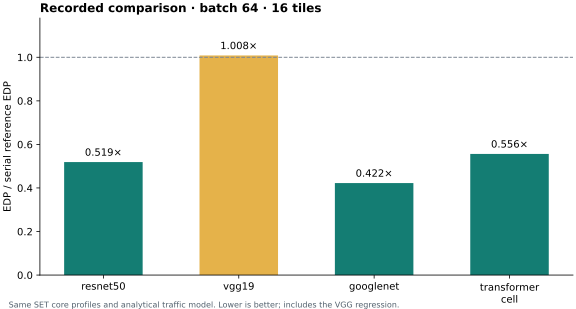
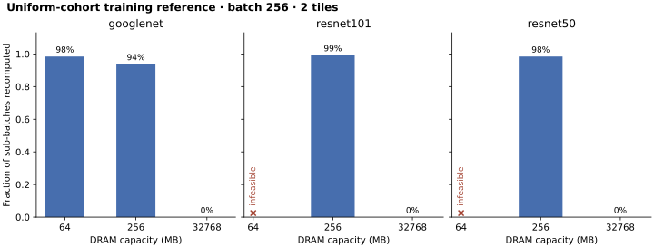

# Recorded reproduction experiments

Metrics are cost-model estimates. Search time is measured wall time. These runs do not establish reproduction of the paper’s headline speedups.

## Inference with native SET core profiles

| Model | Mode | Batch | Latency (ms) | Energy (mJ) | EDP (J·s) | Search (s) |
| --- | --- | ---: | ---: | ---: | ---: | ---: |
| resnet50 | nested | 64 | 26.851 | 132.662 | 0.003562088 | 30.05 |
| resnet50 | serial | 64 | 80.420 | 85.379 | 0.006866235 | 0.84 |
| vgg19 | nested | 64 | 80.155 | 309.436 | 0.02480273 | 6.14 |
| vgg19 | serial | 64 | 77.505 | 317.386 | 0.02459892 | 0.08 |
| googlenet | nested | 64 | 10.548 | 35.939 | 0.0003790969 | 33.59 |
| googlenet | serial | 64 | 26.570 | 33.774 | 0.0008973724 | 1.08 |
| transformer_cell | nested | 64 | 32.470 | 168.792 | 0.005480746 | 37.14 |
| transformer_cell | serial | 64 | 98.138 | 100.412 | 0.009854207 | 1.11 |
| resnet50 | nested | 16 | 10.195 | 24.393 | 0.0002486788 | 30.06 |
| resnet50 | serial | 16 | 20.105 | 21.345 | 0.0004291397 | 0.82 |

Both modes use identical recorded SET Polar core mappings. External traffic uses the Python analytical model. Nested execution uses a conservative half-boundary/half-child memory split. Table occupancy is scoped to top-level boundary buffers; child budgets are recorded separately. VGG-19’s slight EDP regression is retained.

## Training memory reference

The uniform-cohort serial reference checks FW/BW1/recomputation/BW2 coverage and an activation-plus-gradient-workspace budget. It does not exhaust the paper’s per-layer checkpoint choices.

| Model | DRAM (MB) | Outcome | Sub-batch | Retained | Recomputed |
| --- | ---: | --- | ---: | ---: | ---: |
| resnet50 | 64 | infeasible | — | — | — |
| resnet50 | 256 | completed | 2 | 2 | 126 |
| resnet50 | 32768 | completed | 32 | 8 | 0 |
| resnet101 | 64 | infeasible | — | — | — |
| resnet101 | 256 | completed | 2 | 1 | 127 |
| resnet101 | 32768 | completed | 32 | 8 | 0 |
| googlenet | 64 | completed | 2 | 2 | 126 |
| googlenet | 256 | completed | 8 | 2 | 30 |
| googlenet | 32768 | completed | 32 | 8 | 0 |

## Native SET reference runs

Three seeds, 20 SA rounds per layer, four internal trials, batch 64, 4×4 Polar tiles. These use SET’s full placement/traffic evaluator. Cross-model EDP ratios are not claimed as reproduced speedups.

| Network | Runs | Median latency (ms) | Median energy (mJ) | Median EDP (J·s) | Median search (s) |
| --- | ---: | ---: | ---: | ---: | ---: |
| goog | 3 | 13.614 | 44.489 | 0.0006024839 | 21.20 |
| resnet | 3 | 50.811 | 122.011 | 0.006084019 | 12.84 |
| trans_cell | 3 | 56.004 | 161.209 | 0.009028323 | 4.32 |
| vgg | 3 | 77.246 | 326.968 | 0.02525695 | 1.12 |

## Provenance and raw evidence

- `summary.csv`: full-precision tabular metrics; `report.json`: demo/figure data.
- `raw/inference` and `raw/training`: original manifests, gzip-compressed results, configurations and solver logs. Result hashes are verified before report generation.
- `raw/native_set`: upstream seed patches, configurations, native summaries, trees and logs. The pinned source revision is recorded in every manifest.
- Inference source commit: `18edeb7ccf9582b919de998b31b28c846b539a0e`; source digest: `9275e68981908cefbb6301dc036b2dd1b31113548877138ef93d7ab16fa7aec2`.
- The experiment source file hashes are authoritative when documentation/report commits are newer than a run.
- Static weight/optimizer-state capacity and full placement-aware traffic calibration remain outside the training reference/analytical traffic model.
